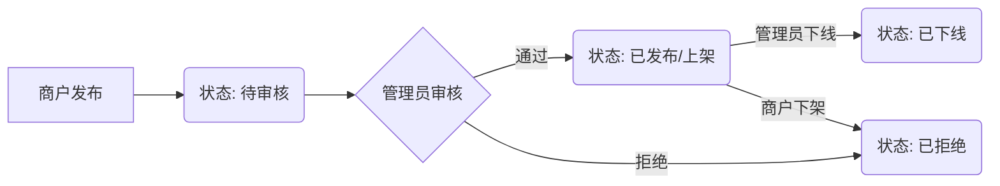
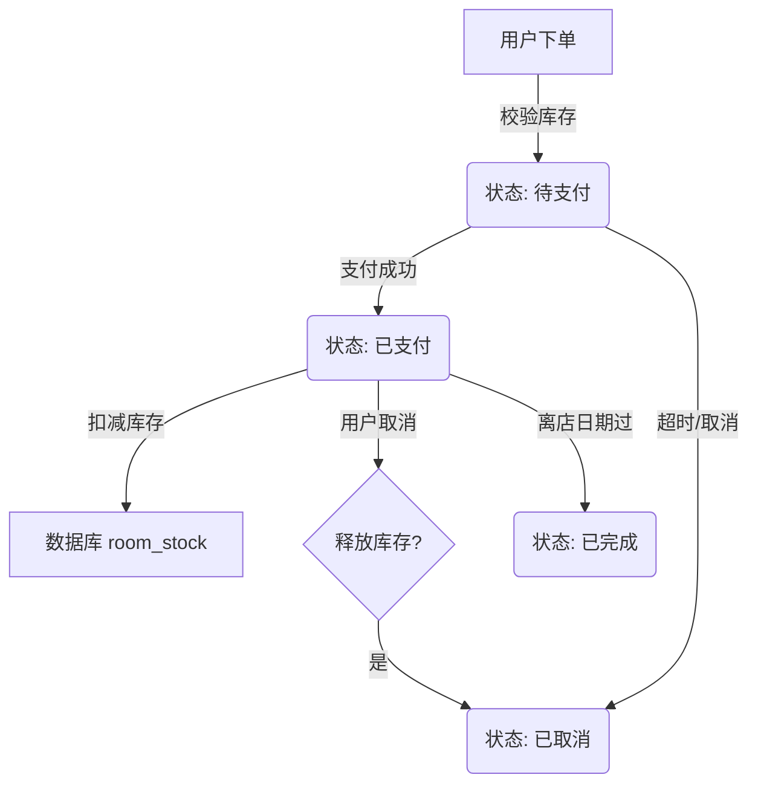

# Easy Travelling 技术文档导览

本文档作为项目的技术地图，汇集了各个模块的详细实现说明与归纳文档，帮助开发人员快速了解系统全貌及各部分细节。

## 1. 项目概览
**Easy Travelling** 是一个基于 React 全栈技术的商旅预订平台，实现了从商户发布、管理员审核到用户预订的完整业务闭环。

- **项目根文档**: [PROJECT_DOCS.md](PROJECT_DOCS.md) - 包含技术栈、架构图、数据库设计及环境配置。
- **快速启动**: [README.md](README.md) - 项目启动命令与调试流程。

## 2. 模块文档索引

### 2.1 移动端 (Mobile)
基于 Taro + React + NutUI，负责用户侧的核心体验。

| 模块 | 路径 | 描述 |
| :--- | :--- | :--- |
| **首页** | [mobile/src/pages/home/README.md](mobile/src/pages/home/README.md) | 沉浸式 Banner、城市级联选择、多条件筛选。 |
| **列表页** | [mobile/src/pages/list/README.md](mobile/src/pages/list/README.md) | 搜索结果展示、前端多维过滤、收藏交互。 |
| **详情页** | [mobile/src/pages/detail/README.md](mobile/src/pages/detail/README.md) | 沉浸式导航、Swiper 轮播聚合、房型库存展示。 |
| **个人中心** | [mobile/src/pages/my/README.md](mobile/src/pages/my/README.md) | 滚动渐变导航栏、登录态管理、功能宫格。 |
| **订单系统** | [mobile/src/pages/order/README.md](mobile/src/pages/order/README.md) | 下单（校验/计价）、列表（状态筛选）、支付（模拟/倒计时）。 |
| **登录/注册** | [mobile/src/pages/login/README.md](mobile/src/pages/login/README.md) | 双模式登录（验证码/密码）、新用户引导设置流程。 |
| **收藏/历史** | [mobile/src/pages/favorite/README.md](mobile/src/pages/favorite/README.md) | 双 Tab 切换、批量管理、本地排序策略。 |

### 2.2 管理后台 (Admin)
基于 Vite + React + Ant Design，负责商户运营与系统管理。

| 模块 | 路径 | 描述 |
| :--- | :--- | :--- |
| **登录页** | [admin/src/pages/login_README.md](admin/src/pages/login_README.md) | 角色分流（商户/管理员）、身份码校验、玻璃拟态设计。 |
| **商户酒店管理** | [admin/src/pages/hotels/README.md](admin/src/pages/hotels/README.md) | 酒店发布（复杂表单/图片并发上传）、列表管理（状态流转）。 |
| **管理员工作台** | [admin/src/pages/admin/README.md](admin/src/pages/admin/README.md) | 审核队列（通过/拒绝/下线）、全局酒店监管、个人中心。 |

### 2.3 后端服务 (Server)
基于 Node.js + Express + MySQL，提供稳健的 API 支持。

| 模块 | 路径 | 描述 |
| :--- | :--- | :--- |
| **核心服务** | [server/README.md](server/README.md) | 数据库连接池、JWT 鉴权、库存并发控制（事务锁）、OSS/SMS 集成。 |

## 3. 核心业务流程图解

### 3.1 酒店发布与审核

### 3.2 订单流转与库存扣减

## 4. 常用维护命令

- **启动所有服务**: 
  - Server: `cd server && npm run dev`
  - Mobile: `cd mobile && npm run dev:h5`
  - Admin: `cd admin && npm run dev`
- **数据库备份**: 建议定期导出 `easy_travel_db` 结构与数据。
- **清理日志**: 后端日志目前输出至控制台，生产环境建议接入 PM2 日志管理。

---
*文档生成日期: 2026-02-27*
